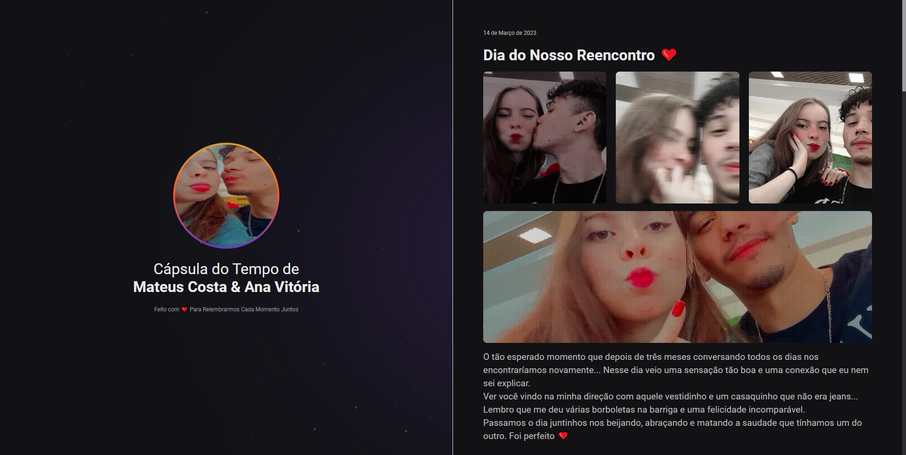

 

## 💻 Projeto

Esse é um projeto Web Responsivo de uma cápsula do tempo para exibir memórias em uma Timeline.

## 🚀Tecnologias

Esse projeto foi desenvolvido com as seguintes tecnologias:

-HTML
-CSS
-Git e Github
